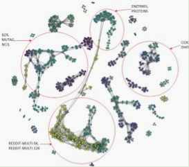
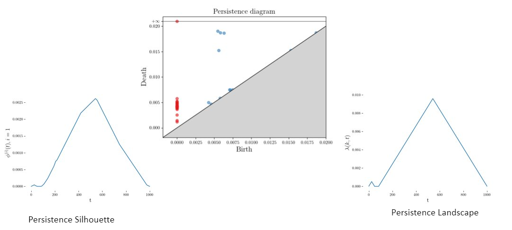

```{r setup, include=FALSE}
knitr::opts_chunk$set(echo = TRUE)
```
## Part 1

<br>

#### **What is Topological Data Analysis?**

  Topological Data Analysis (TDA) is primarily driven by the belief that topology and geometry offer a robust approach to extracting qualitative and sometimes quantitative information about the underlying structure of data. The objective of TDA is to establish mathematically rigorous, statistical, and  algorithmic methods for inferring, analyzing, and leveraging the intricate topological and geometric structures present in data, often represented as point clouds (each dot of the pot) in Euclidean or more general metric spaces.
 
<center>
{width=25%}{width=20%}   
**Point Cloud** and **Euclidean Space**
</center>

<br>
 
 A metric space (M, ρ) is a set M with a function ρ ∶M × M → R+, called a distance, such that for any x, y, z ∈ M:
 
  * ρ(x, y) ≥ 0 and ρ(x, y) = 0 if and only if x = y,  
  * ρ(x, y) = ρ(y, x) and,  
  * ρ(x, z) ≤ ρ(x, y) + ρ(y, z).
    
<br>

#### **TDA Process in Machine Learning**

**#1**

  The input data is considered to be a finite collection of points, and there exists a
measure of distance or similarity between these points. This distance can be determined by the metric of the surrounding space, such as the Euclidean metric if the data is embedded in ℝ^d, or it can be defined by a pairwise distance matrix intrinsic to the data.  

  The specification of the metric for the data is typically provided as an input or guided by the specific application. However, it is crucial to acknowledge that the choice of metric plays a significant role in uncovering noteworthy topological and geometric characteristics of the data

**#2a**

  A continuous shape is constructed to emphasize the underlying topology or geometry of the data
<center>
  {width=30%}
</center>

**#2b**

  This shape is typically a simplicial complex or a sequence of nested simplicial complexes known as a filtration, which captures the data's structure at various scales.
<center>
  {width=20%}
</center>

**#2c**

  This shape is typically a simplicial complex or a sequence of nested simplicial complexes known as a filtration, which captures the data's structure at various scales.
<center>
  
</center>

**#2d**

  Simplicial complexes can be seen as higher-dimensional extensions of neighborhood graphs commonly used in standard data analysis and learning algorithms.
  
  The task at hand is to define these structures in a way that is mathematically proven to reflect meaningful information about the data's structure and can be efficiently constructed and manipulated in practical applications.
<center>
  {width=45%}
</center>

**#3**

  The structures constructed on the data provide a means to extract topological or geometric information.It may involve generating rough summaries or approximations that require specific methods, such as persistent homology, to extract relevant information.
<center>
  
</center>

**#4**

  The topological and geometric information extracted offers novel sets of features
and descriptors for the data. These features can enhance the understanding of the data, especially through visualization techniques. They can also be combined with other types of features to enable more comprehensive analysis and facilitate machine learning tasks. Furthermore, this information can be utilized to design data analysis and machine
learning models that are well-suited to the specific characteristics of the data. An essential consideration at this stage is demonstrating the added value and
complementarity of the information provided by TDA tools compared to other
features.

  Understanding how the extracted information complements existing features and showcases its advantages is a key aspect of this process.

<br>

#### **The Language of TDA**

**#Simplicial complexes - 1**

  Simplicial complexes can be regarded as an extension of graphs to higher dimensions. They are mathematical entities that possess both **topological** and **combinatorial** characteristics, which makes them particularly valuable for Topological Data Analysis.
  
  Two important aspects of these mathematical objects:
  
  * Topological characteristics: Simplicial complexes have a topological nature, meaning they capture information about the connectivity and spatial relationships between their constituent simplices (e.g., vertices, edges, higher-dimensional faces). They provide a framework to study topological properties such as connectedness, boundaries, holes, and higher-dimensional structures.
  * Combinatorial characteristics: Simplicial complexes have combinatorial properties, which deal with the combinatorial arrangements and relationships between their simplices. These properties involve how the simplices are combined, their intersections, and the inclusion relations between different simplices.
    
**#Simplicial Complexes - 2**

  Given a set X = {x0,···,xk} C R^d consisting of k + 1 affinely independent points, the k-dimensional simplex σ = [x0,···xk] spanned by X can be defined as the convex hull of X.
  
  Affinely independent points refers to a set of points in a vector space that do not lie on the same affine subspace, except when the set consists of a single point. In other words, a set of points {x0, x1, x2,···,xn} is said to be affinely independent if there is no non-trivial linear combination of the points that results in the zero vector, except when all the coefficiants are zero.
  
  In layman's terms can be understood as a set of points that are not in a straight line or a flat plane.
  
**#Simplicial Complexes - 3**

  Given a set X {xo,···,Xk} C R^d consisting of k + 1 affinely independent points, the k- dimensional simplex σ = [x0,···,Xk] spanned by X can be defined as the convex hull of X.
  
  The convex hull of a set of points is the smallest convex shape or region that completely encloses all the points. In simpler terms, it is like finding the "outer boundary" that wraps around a given set of points.
  
  Mathematically, an n-dimensional simplex is defined as the convex hull of (n + 1) affinely independent points in n-dimensional space. In other words, it is the smallest convex shape or region that contains these points. For example, a 1-dimensional simplex is a line segment, a 2-dimensional simplex is a triangle, a 3-dimensional simplex is a tetrahedron, and so on.
<center>
  {width=25%}
</center>

**#Simplicial Complexes - 4**

  Given a set X = {xo,···, xk} < R consisting of k + 1 affinely independent points, the k- dimensional simplex σ = [Xo,···, Xk] spanned by X can be defined as the convex hull of X.
  
  Mathematically, an n-dimensional simplex is defined as the convex hull of (n + 1) affinely independent points in n-dimensional space. In other words, it is the smallest convex shape or region that contains these points. For example, a 1-dimensional simplex is a line segment, a 2-dimensional simplex is a triangle, a 3-dimensional simplex is a tetrahedron, and so on.
<center>
  {width=35%}
</center>

**#Simplicial Complexes - 5**

  A geometric simplicial complex K in R^d is a collection of simplices satisfying the following conditions:
  
  * Every face of a simplex in K is also a simplex in K.
  * The intersection of any two simplices in K is either empty or a common face shared by both simplices.

  The face of a simplex refers to a lower-dimensional simplex that is a subset of the original simplex. In other words, it is a subset of the vertices of the simplex that defines a smaller simplex within it.
  
**#Simplicial Complexes - 6**

  For example, in a 3-dimensional simplex (tetrahedron), the faces are triangles, and in a 4-dimensional simplex, the faces are tetrahedra. 

  The faces of a simplex are simplices themselves, but of lower dimension.
<center>
  {width=30%}
</center>

**#Simplicial Complexes - 7**
  
  The collection of simplices in a simplicial complex K forms a subset of Rd known as the underlying space of K, which inherits the topology of R^d. Consequently, K can be regarded as a topological space based on its underlying space. It's worth noting that once the vertices of K are determined, the combinatorial description of the collection of simplices, adhering to certain incidence rules, fully characterizes K.
  
  * When we say that a simplicial complex K can be regarded as a topological space based on its underlying space, we mean that we can associate a topological structure to K by considering the topology inherited from its underlying space.
  * The underlying space of K is a subset of Rd that contains all the points corresponding to the vertices, edges, faces, and higher-dimensional simplices of K.
    
**#Building simplicial complexes from data**

  There exist many ways to build simplicial complexes. We present here a few classical examples that are widely used in practice. An initial example is an immediate extension of the concept of an a-neighboring graph. 
  
  Suppose we have a set of points, X, in a metric space (M, p), and a real number a ≥ 0. The Vietoris-Rips complex, denoted as Ripsa (X), consists of simplices [xo,···, Xk] satisfying the condition that the distance between any pair of points, dx (xi, xj), is less than or equal to a for all (i, j).
  
  Each circle (called a closed ball) has a data point at its center, and the circle radius is the distance from the data point
<center>
  {width=55%}
</center>
  <br>
  However, it's important to note that in general, even when X is a finite subset of R^d, Ripsa (X) may not have a geometric realization in R^d. In other words, it may have a dimension higher than d. Can you figure out why?
  
  Closely connected to the Vietoris-Rips complex is the Čech complex, denoted as Cecha (X). It is defined as the set of simplices. [xo,···, Xk] such that the k + 1 closed balls, B(xi, α), have a non-empty intersection. It's worth noting that these two complexes are related as follows: Ripsa (X) is a subset of Cecha (X), and Cecha (X) is a subset of Rips2a (X). Additionally, if X is a subset of R^d, then Cecha (X) and Rips2a (X) share the same 1- dimensional skeleton, meaning they have the same set of vertices and edges.

**#Main Directions in TDA - simplified classification**

  Persistent Homology (PH): study of topological shapes that can fit into your data
  <center>
    {width=30%}
  </center>
  
  TDAMapper: the overall shape of your data  
  
  * Both have filtrations and distances, but Mapper studies about how your entire data is shaped and deduces insights from that shape.
  <center>
    {width=20%}
  </center>
  
#### **Persistent Homology in TDA.**

**#What is Homology?**
  
  Homology, in a nutshell, is a fundamental concept in algebraic topology that provides a powerful tool for formalizing and analyzing topological features of spaces or simplicial complexes in an algebraic manner. It enables us to capture and quantify the presence of different-dimensional "holes" within a given space.
  
  In homology, each dimension k corresponds to a vector space Нk, where the dimension of Hk intuitively represents the number of independent features of that dimension. For instance, the O-dimensional homology group Ho describes the connected components of the complex, the 1-dimensional homology group H1 represents the 1-dimensional loops or cycles, and the 2-dimensional homology group H2 captures the 2-dimensional cavities or voids within the space.
  
  Homology provides a rigorous framework for understanding and characterizing topological structures by associating vector spaces to each dimension, giving us valuable information about the presence and properties of various topological features within a space or simplicial complex.
  
  In simple terms, we are defining topological structures (i.e., k-dimensional holes) and counting them in a simplicial complex (SC). 
  
  What are these holes?
  
  * The term "dimensional holes" refers to the topological features captured by the homology groups of a simplicial complex.
  * These holes represent voids or empty spaces of different dimensions within the data.
  * In the context of TDA, the term "hole" does not refer to a literal physical hole but rather to a topological concept.
  * A dimensional hole can be understood as a region or subspace of the data that is missing or empty, characterized by the absence of certain simplices or simplicial structures.
    
  O-dimensional holes are connected components in a SC:
  
  * K1 has 12 0-dimensional holes  
  * K2 has larger balls, but there are still 12 holes.  
  * K3 now has edges between simplices. There are 6 0-dimensional holes.  
  * K4 has just one connected component; 1 0-dimensional hole.
    
  1-dimensional holes are loops in a SC:
  
  * K1 does not have a 1-dimensional hole  
  * K2 has larger balls, but no 1-dimensional holes.  
  * K3 now has edges between simplices, but no 1-dimensional holes.  
  * K4 has a loop now; it has a 1-dimensional hole.

<center>
  
</center>

**#Homology**

  To extract summaries of such topological features at a mesoscopic level, we use Betti numbers. Betti-p number of a simplicial complex C of dimension d, denoted by ẞp (C), is defined as
<center>
  {width=55%}
</center>
<center>
{width=55%}
</center>

**#Persistent Homology**

  We can increase k as much as we want, however we do not see k>2 holes often in our experiments. 
  
  Formal definitions for the holes can be found in works such as  
  * Edelsbrunner, H. and Harer, J., 2008. Persistent homology-a survey. Contemporary mathematics, 453(26), pp.257-282.  
  * Otter, N., Porter, M.A., Tillmann, U., Grindrod, P. and Harrington, H.A., 2017. A roadmap for the computation of persistent homology. EPJ Data Science, 6, pp.1-38.
    
**#What is Persistent in PH?**
  
  Persistent homology in a nutshell:
  
  1. Given X data points in R^d  
  2. Find pairwise distances  
  3. Use a filtration threshold on distances from 0 to maximum  
      a. Create simplices and a simplicial complex out of them,  
      b. Identify certain topological features - what are they? We need to talk about shapes to answer this question.  
      c. Identify which holes persist (i.e., born and survive)
  4. Use the vectorization in ML tasks
    
**#What is filtration?**
  
  A filtration of a simplicial complex K is a collection of subcomplexes (Kr)rET that are nested, meaning that for any r0 and rp in the set T, if r is less than or equal to r0, then Kr is a subset of Kro.
  
  The entire complex K is obtained by taking the union of all the subcomplexes Kr for r in T. In a more general sense, a filtration of a topological space M is a collection of subspaces
(Mr)rET that are nested. Similar to the simplicial complex case, if r is less than or equal to
ro, then Mr is a subset of Mr0. The entire space M is obtained by taking the union of all the subspaces Mr for rin T.
<center>
  
</center>

**#Persistence Diagrams**
  
  In practical situations, the parameter r E T can often be interpreted as a scale parameter.
  
  We alternate between scale and distance to refer to r. We mostly use the term distance and use Є or α to refer to the distance threshold in our articles.
  
  Filtration tracks the appearance of shapes along the distance threshold α.
  
  The information gathered through filtration is stored in persistence diagrams (PDs), which consist of a multiset of points supported on the open half-plane {(αb, αa) Ɛ R^2: αb <

**#PD for 1-dimension holes**

<center>
  {width=70%}
</center>
<br>

**#Vectorizations for 0 and 1-dimensional holes**

<center>
  {width=75%}
</center>
