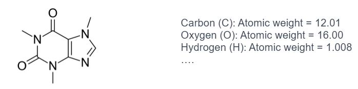
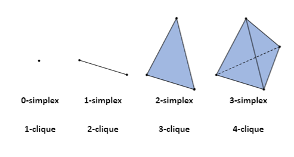
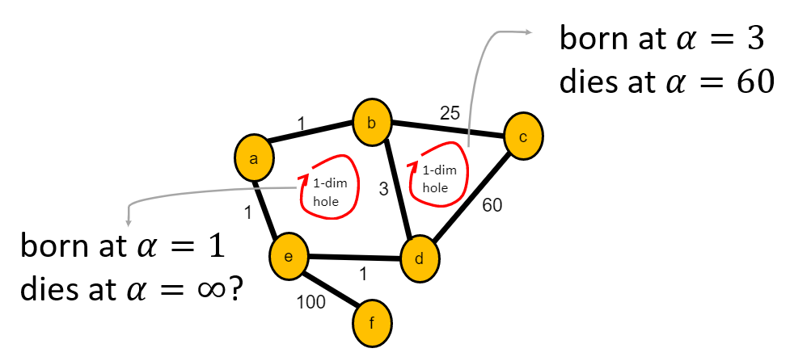
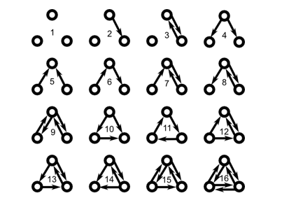
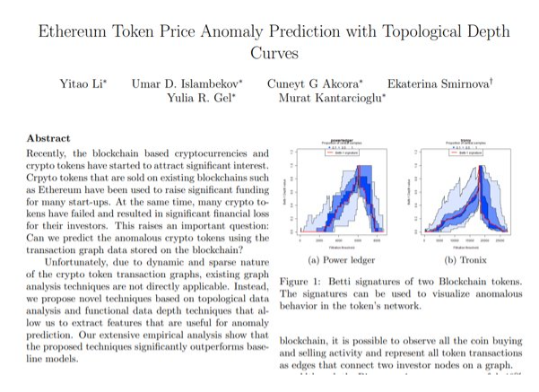

```{r setup, include=FALSE}
knitr::opts_chunk$set(echo = TRUE)
```
## Part 2

<br>

#### **Graph Persistent Homology**

**#Edge Activations**

  Consider the graph below where edge weights indicate distances.
  
  Lets use a Vietoris Rips complex: denoted as Ripsɑ(X), consists of simplices [x0,...,xk] satisfying the condition that the distance between any pair of points, dx (xi, xj), is less than or equal to a for all (i, j).
<center>
  {width=30%}
</center>
  
  Min scale = 0 (we could start from 0.5 or any other value as well)
  
  Max scale = 100 (we could go longer, but it would not change anything)
  
<center>
  {width=60%}
</center>

  Multiple questions:
  
  * Question 1: How do we define a distance based on edge weights? In the previous slide, the edge weights represented distances, eliminating the need for explicit distance definition.
  * Question 2: What happens if the graph is unweighted?
    1. Graph resistance distance: In a graph, the resistance between two vertices measures the level of difficulty for electric current to flow between them.
    2. Shortest path distance (works with weighted edges as well):  a measure of the minimum number of edges along the shortest path between two vertices in a graph.
    3. Ricci curvature (works with weighted edges as well): the concept of Ricci curvature is a generalization of Ricci curvature from Riemannian geometry. It provides a way to quantify the geometric properties of the network based on its connectivity and edge weights.
<center>
  {width=60%}
</center>

  Question 3: What happens if the graph is directed?
  
  * Use distance measures introduced in the first question, but define distances based on incoming or outgoing edges only

**#Node Activation**

  Consider the graph below where node features indicate ages.
<center>
  {width=30%}
</center>

  We will use sub or super level filtration.
  
  * Sublevel: filtration from minimum to maximum scales
  * Superlevel: filtration from maximum to minimum scales
  
  Min scale = 10 (we could start from 15 or any other value as well)
  
  Max scale = 80 (we could go longer, but it would not change anything)
  
<center>
  {width=60%}
</center>

  Multiple Questions:
  
  * Question 1: How do we define node activation values? May come from domain: in molecular networks, atomic weights of molecules.
<center>
  {width=80%}
</center>
  * Question 2: Sub or super level? Usually researchers apply both and concatenate vectorizations.
  * Question 3: On directed or weighted graphs? We need to define node features based on their edges. This is a common issue in weighted blockchain networks.
  
<br>

#### **A few tips and insights for TDA on graphs**

**#Simplex vs Clique**

  Math: Mathematically, a k-dimensional simplex is defined as the convex hull of (k + 1) affinely independent points in k-dimensional space. 
  
  CS: In graph theory, a k-clique refers to a subset of k vertices in a graph where every vertex is directly connected to every other vertex in the subset.
<center>
  {width=40%}
</center>

**#K-dimensional holes**

  A k-dimensional hole requires vertices with at least degree k+1 (Vietoris-Rips here).

<center>
  {width=60%}
  </center>

**#Power of PH**

  Persistent homology is powerful because it allows us to track the birth and death of dimensional features at various scales.
  
  Insight from [Yulia R. Gel](https://scholar.google.com/citations?user=MAFTn7gAAAAJ&hl=en) of UTD Math: This PH information is similar to what we get in graph motif analysis, but with finer granularity. 
  
  * Graph motif analysis is a method used in graph theory and network analysis to identify and analyze recurring patterns or subgraphs within a larger graph.
  * A motif is defined as a small subgraph that appears more frequently in a graph than would be expected by chance alone.
<center>
  {width=35%}
</center>

#### **Applications of TDA on graphs**

<center>
  {width=50%}
</center>


  
