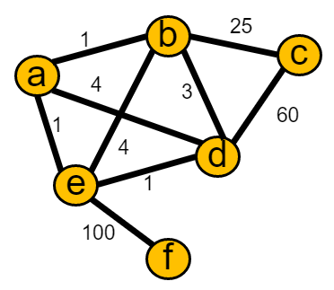
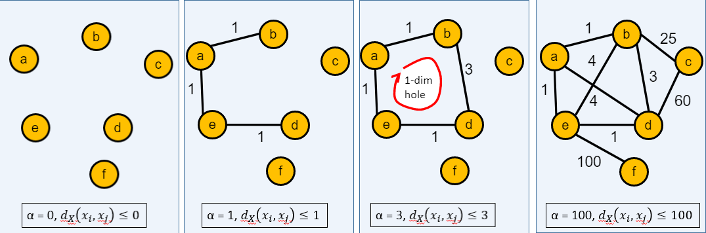
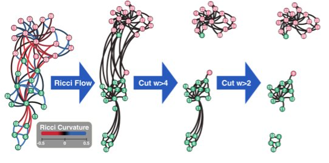
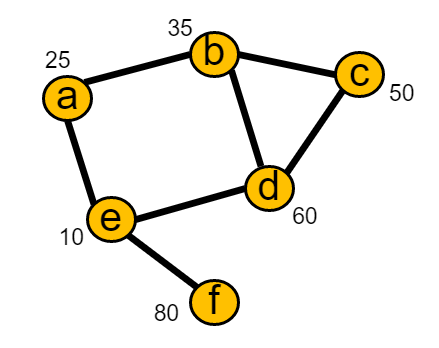
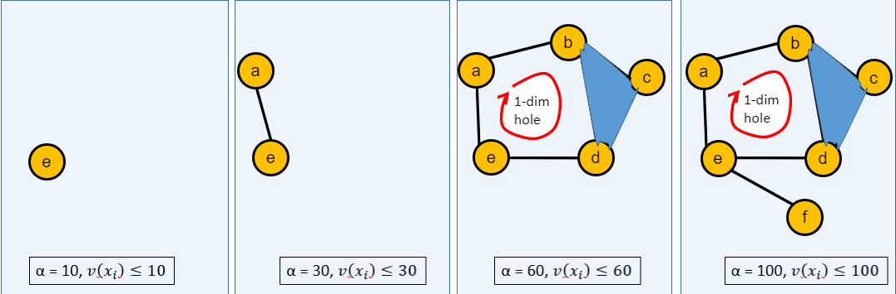

```{r setup, include=FALSE}
knitr::opts_chunk$set(echo = TRUE)
```
## Part 2

<br>

#### **Graph Persistent Homology**

**#Edge Activations**

  * Consider the graph below where edge weights indicate distances.
  
  * Lets use a Vietoris Rips complex: denoted as Ripsɑ(X), consists of simplices [x0,...,xk] satisfying the condition that the distance between any pair of points, dx (xi, xj), is less than or equal to a for all (i, j).
<center>
  {width=30%}
</center>
  
  * Min scale = 0 (we could start from 0.5 or any other value as well)
  
  * Max scale = 100 (we could go longer, but it would not change anything)
<center>
  {width=80%}
</center>

  * Multiple questions:
    * Question 1: How do we define a distance based on edge weights? In the previous slide, the edge weights represented distances, eliminating the need for explicit distance definition.
    * Question 2: What happens if the graph is unweighted?
      1. Graph resistance distance: In a graph, the resistance between two vertices measures the level of difficulty for electric current to flow between them.
      2. Shortest path distance (works with weighted edges as well):  a measure of the minimum number of edges along the shortest path between two vertices in a graph.
      3. Ricci curvature (works with weighted edges as well): the concept of Ricci curvature is a generalization of Ricci curvature from Riemannian geometry. It provides a way to quantify the geometric properties of the network based on its connectivity and edge weights.
<center>
  {width=60%}
</center>
  * Question 3: What happens if the graph is directed?
    * Use distance measures introduced in the first question, but define distances based on incoming or outgoing edges only

**#Node Activation**

  * Consider the graph below where node features indicate ages.
<center>
  {width=30%}
</center>
  * We will use sub or super level filtration. 
    * Sublevel: filtration from minimum to maximum scales
    * Superlevel: filtration from maximum to minimum scales
  
  * Min scale = 10 (we could start from 15 or any other value as well)
  
  * Max scale = 80 (we could go longer, but it would not change anything)
<center>
  {width=80%}
</center>